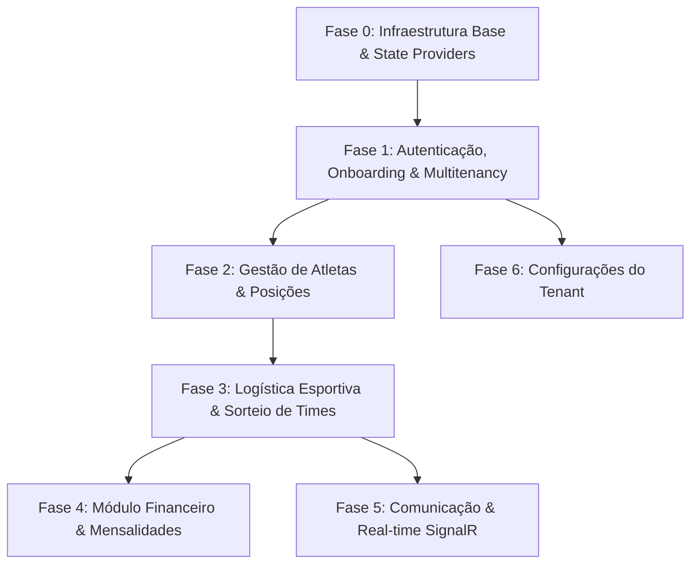

# Guia de Implementação e Migração Blazor (.NET 10) - Baba Play

Este documento serve como o **guia definitivo e sequencial** para a criação do Front-end em **Blazor (.NET 10)** do **Baba Play**, substituindo o antigo front-end em React.

Todas as diretrizes e regras definidas em [`agents.md`](file:///home/rony/LPR/babaplay/agents.md) e [`architecture.md`](file:///home/rony/LPR/babaplay/architecture.md) devem ser rigorosamente seguidas durante a implementação de cada função.

---

## 1. Regras Arquiteturais e Padrões Blazor (.NET 10)

1. **Separação Estrita e Desacoplamento:**
   * O projeto Blazor (`BabaPlay.Web`) é **100% cliente da API**. 
   * Não há referência direta ao Entity Framework Core, DbContext ou pacotes de persistência do backend.
   * Toda a comunicação ocorre exclusivamente via requisições HTTP REST chamando os endpoints CQRS da Web API (`BabaPlay.Api`).
   * Os dados trafegam usando DTOs (Data Transfer Objects) dedicados ao front-end.

2. **Multitenancy & Segurança:**
   * O token JWT obtido no login armazena as claims do usuário e as associações (tenants) das quais ele faz parte.
   * Cada requisição HTTP enviada pelos services do Blazor deve incluir o cabeçalho `Authorization: Bearer <token>` e `X-Tenant-Slug: <tenant-slug>`.
   * As rotas protegidas utilizam `AuthorizeRouteView` e `CascadingAuthenticationState`.
   * Gates de escrita de comunicação na UI usam `CommunicationWriteView`, baseado em `TenantState.Permissions` (via `GET /api/v1/auth/me/permissions`) com fallback para `TenantState.IsOwner`. A policy `CommunicationWrite` também fica registrada em `AddAuthorizationCore`; a API continua sendo a fonte da verdade nas escritas. Em restore de sessão, owner e permissões são sincronizados via API.

3. **Gerenciamento de Estado (State Management):**
   * Usar serviços com escopo (`Scoped`) para manter o estado da sessão do usuário (`UserSessionState`), tenant ativo (`TenantState`) e carrinho/ações temporárias.
   * Notificação de alterações de estado via `event Action OnChange`.

4. **Metodologia TDD (Test-Driven Development no Blazor):**
   * A criação de componentes e services deve ser acompanhada de testes unitários e de renderização usando **bUnit** e **xUnit**.
   * Testar estados de carregamento (Loading), erro (Error banner), sucesso e formulários com validação (`EditForm`, `DataAnnotationsValidator`).

---

## 2. Estrutura Recomendada do Projeto Blazor

```text
Backend/src/BabaPlay.Web/ (ou src/BabaPlay.Blazor/)
├── Components/
│   ├── Layout/
│   │   ├── MainLayout.razor
│   │   ├── NavMenu.razor
│   │   ├── Header.razor
│   │   └── PublicLayout.razor
│   ├── Common/
│   │   ├── LoadingSpinner.razor
│   │   ├── ConfirmModal.razor
│   │   ├── Badge.razor
│   │   └── StatCard.razor
├── Features/
│   ├── Auth/
│   ├── Onboarding/
│   ├── Players/
│   ├── Matches/
│   ├── Teams/
│   ├── Financial/
│   └── Communication/
├── Services/
│   ├── Http/
│   │   ├── AuthApiService.cs
│   │   ├── PlayerApiService.cs
│   │   ├── MatchApiService.cs
│   │   └── ...
│   ├── State/
│   │   ├── CustomAuthStateProvider.cs
│   │   ├── TenantState.cs
│   │   └── UserSessionState.cs
│   └── Handlers/
│       └── AuthorizationHeaderHandler.cs
├── Models/ DTOs do Frontend
└── App.razor
```

---

## 3. Ordem Lógica de Construção (Fases & Dependências)

A construção deve obrigatoriamente seguir a ordem de dependência lógica de negócio:



---

## 4. Guia Detalhado de Implementação por Função

---

### Fase 0: Infraestrutura Base do Blazor

#### **[F00] Setup da Aplicação, Layout Master & HTTP Client Base**
* **Objetivo:** Criar o projeto Blazor WebAssembly / Auto em .NET 10, configurar a injeção de dependência do `HttpClient`, manipulador de Token JWT (`AuthorizationHeaderHandler`) e o sistema de design (CSS/Layout).
* **Componentes / Arquivos:**
  * `Program.cs` (Configuração de DI, `HttpClient`, `AuthenticationStateProvider`)
  * `Services/Handlers/AuthorizationHeaderHandler.cs` (Injeta Bearer Token e `X-Tenant-Slug`)
  * `Program.cs` — registrar `HttpClient` autenticado no mesmo scope da UI (evitar `IHttpClientFactory` para esse client)
  * `Services/State/CustomAuthStateProvider.cs` (Gerencia estado do JWT e Claims)
  * `Components/Layout/MainLayout.razor` & `PublicLayout.razor`
* **Testes bUnit/xUnit:** Testar se o `AuthorizationHeaderHandler` anexa os cabeçalhos corretos e se `CustomAuthStateProvider` parseia as claims do JWT corretamente.

---

### Fase 1: Módulo Identity (Autenticação, Onboarding & Multitenancy)

#### **[F01] Autenticação (Login & Logout)**
* **Objetivo:** Permitir login via e-mail e senha, armazenar o token JWT com segurança (localStorage/sessionStorage via IJSRuntime/ProtectedLocalStorage) e atualizar o estado global do usuário.
* **Componentes / Páginas:** `Pages/Auth/Login.razor`
* **Services & DTOs:**
  * `IAuthApiService` (`LoginAsync(LoginDto dto)`)
  * `LoginDto`, `AuthResponseDto`
* **Endpoints API Consumidos:** `POST /api/v1/auth/login`
* **Testes bUnit:**
  * Renderização de campos e validação de e-mail/senha.
  * Comportamento ao receber 401 Unauthorized (mensagem de erro).
  * Redirecionamento correto pós-login para a dashboard ou seleção de tenant.

#### **[F02] Recuperação e Redefinição de Senha**
* **Objetivo:** Solicitar link de redefinição por e-mail e processar a troca de senha com o token de recuperação.
* **Componentes / Páginas:** 
  * `Pages/Auth/ForgotPassword.razor`
  * `Pages/Auth/ResetPassword.razor`
* **Services & DTOs:**
  * `IAuthApiService` (`ForgotPasswordAsync`, `ResetPasswordAsync`)
  * `ForgotPasswordDto`, `ResetPasswordDto`
* **Endpoints API Consumidos:** `POST /api/v1/auth/forgot-password`, `POST /api/v1/auth/reset-password`
* **Testes bUnit:** Validação de formato de senha, correspondência entre "Nova Senha" e "Confirmação", feedback visual de sucesso.

#### **[F03] Seleção de Associação (Tenant Selector)**
* **Objetivo:** Se o usuário pertencer a múltiplos Tenants, permitir a escolha de qual associação deseja acessar na sessão atual.
* **Componentes / Páginas:** `Pages/Tenant/SelectTenant.razor`
* **Services & DTOs:** `TenantState.cs`, `TenantSummaryDto`
* **Endpoints API Consumidos:** `GET /api/v1/tenants/my-memberships`
* **Testes bUnit:** Testar a renderização dos cards das associações e a alteração do `TenantState.CurrentTenantId` no clique.

#### **[F04] Onboarding de Associação (Criar Novo Tenant)**
* **Objetivo:** Formulário para cadastrar uma nova associação/liga (White Label, upload de logotipo, cores primárias/secundárias e dados da diretoria).
* **Componentes / Páginas:** `Pages/Tenant/RegisterAssociation.razor`
* **Services & DTOs:** `ITenantApiService` (`CreateTenantAsync`), `CreateTenantDto`
* **Endpoints API Consumidos:** `POST /api/v1/tenants` (`CreateTenantCommand`)
* **Testes bUnit:** Validação do formulário de criação e envio de dados multipart/json para upload do escudo.

#### **[F05] Aceitar Convite de Associação**
* **Objetivo:** Tela pública onde um atleta/membro clica no link recebido (com token) para vincular sua conta a um Tenant existente.
* **Componentes / Páginas:** `Pages/Tenant/AcceptInvite.razor`
* **Services & DTOs:** `ITenantApiService` (`AcceptInviteAsync`), `AcceptInviteDto`
* **Endpoints API Consumidos:** `POST /api/v1/tenants/invites/accept`
* **Testes bUnit:** Testar validação de token expirado ou inválido e feedback de vínculo efetuado.

#### **[F06] Conclusão de Perfil do Atleta (Player Onboarding)**
* **Objetivo:** Primeiro acesso do atleta para preenchimento obrigatorio de pé preferido, posição principal, número da camisa e foto.
* **Componentes / Páginas:** `Pages/Players/CompleteProfile.razor`
* **Services & DTOs:** `IPlayerApiService` (`CompleteProfileAsync`), `PlayerProfileDto`
* **Endpoints API Consumidos:** `PUT /api/v1/players/profile`
* **Testes bUnit:** Garantir que o formulário impede o avanço enquanto campos obrigatórios (ex: posição) não forem preenchidos.

---

### Fase 2: Gestão de Atletas e Posições (Identity / Sports Base) ✅ CONCLUÍDA

#### **[F07] Lista e Gestão de Atletas (Membros da Associação)** ✅ CONCLUÍDO
* **Objetivo:** Tabela/Grid responsiva de atletas do Tenant, permitindo busca por nome, filtro por posição/status (Ativo/Inativo), alteração de perfil/função (RBAC: Admin, Treinador, Atleta).
* **Componentes / Páginas:** 
  * `Pages/Players/PlayerList.razor`
  * `Components/Players/PlayerCard.razor`
  * `Components/Players/EditPlayerModal.razor`
* **Services & DTOs:** `IPlayerApiService`, `PlayerDto`, `UpdatePlayerAdminDto`, `RoleDto`
* **Endpoints API Consumidos:** `GET /api/v1/player`, `POST /api/v1/role/{roleId}/users/{userId}`, `PUT /api/v1/player/{id}`
* **Testes bUnit:** `PlayerCardTests.cs`, `EditPlayerModalTests.cs`, `PlayerListTests.cs`.

#### **[F08] Cadastro e Gestão de Posições e Categorias** ✅ CONCLUÍDO
* **Objetivo:** Cadastro de posições personalizadas do baba (ex: Goleiro, Fixo, Ala, Pivô, Zagueiro, Meia, Atacante) e níveis de habilidade.
* **Componentes / Páginas:** 
  * `Pages/Settings/PositionsManagement.razor`
  * `Components/Settings/PositionModal.razor`
* **Services & DTOs:** `IPositionApiService`, `PositionDto`, `CreatePositionDto`, `UpdatePositionDto`
* **Endpoints API Consumidos:** `GET /api/v1/position`, `POST /api/v1/position`, `PUT /api/v1/position/{id}`, `DELETE /api/v1/position/{id}`
* **Testes bUnit:** `PositionModalTests.cs`, `PositionsManagementTests.cs`.

#### **[F09] Carteirinha Digital do Associado** ✅ CONCLUÍDO
* **Objetivo:** Componente visual para renderizar a carteirinha virtual do associado, contendo QR Code para validação de acesso, foto, validade e status.
* **Componentes / Páginas:** 
  * `Pages/Players/DigitalIdCard.razor`
  * `Components/Players/DigitalIdCardWidget.razor`
  * `Services/Helpers/QrCodeSvgHelper.cs`
* **Services & DTOs:** `IPlayerApiService` (`GetDigitalIdCardAsync`), `DigitalCardDto`
* **Endpoints API Consumidos:** `GET /api/v1/player/digital-card`
* **Testes bUnit:** `DigitalIdCardWidgetTests.cs`, `DigitalIdCardPageTests.cs`.


---

### Fase 3: Logística Esportiva, Sorteio e Partidas (`BabaPlay.Sports`)

#### **[F10] Dashboard Principal do Tenant** ✅ CONCLUÍDO
* **Objetivo:** Painel de controle da associação exibindo métricas rápidas (próximo jogo, contagem de confirmados, últimos comunicados, estatísticas da temporada).
* **Componentes / Páginas:** 
  * `Pages/Dashboard/Dashboard.razor`
  * `Components/Dashboard/NextMatchWidget.razor`
  * `Components/Dashboard/QuickStatsWidget.razor`
  * `Components/Dashboard/RecentAnnouncementsWidget.razor`
* **Services & DTOs:** `IDashboardApiService`, `DashboardApiService`, `DashboardSummaryDto`, `NextMatchWidgetDto`, `QuickStatsDto`, `RecentAnnouncementDto`
* **Endpoints API Consumidos:** `GET /api/v1/dashboard/summary` (dados reais: avisos publicados, scores, mensalidades e check-ins do tenant; zeros/lista vazia quando não houver registros)
* **Testes bUnit/xUnit:** `NextMatchWidgetTests.cs`, `QuickStatsWidgetTests.cs`, `DashboardPageTests.cs`, `GetDashboardSummaryQueryHandlerTests.cs`.


#### **[F11] Agendamento e Calendário de Partidas/Treinos** ✅ CONCLUÍDO
* **Objetivo:** Criar, editar e visualizar o calendário de eventos esportivos (local, data/hora, limite de vagas, valor por atleta se houver).
* **Componentes / Páginas:** 
  * `Pages/Matches/MatchList.razor`
  * `Components/Matches/MatchCard.razor`
  * `Components/Matches/MatchModal.razor`
* **Services & DTOs:** `IMatchApiService`, `MatchApiService`, `MatchDto`, `ScheduleGameDayDto`, `GameDayDto`, `CreateMatchDto`, `UpdateMatchDto`
* **Endpoints API Consumidos:** `GET /api/v1/match`, `POST /api/v1/match`, `PUT /api/v1/match/{id}`, `DELETE /api/v1/match/{id}`, `GET /api/v1/gameday`, `POST /api/v1/gameday`
* **Testes bUnit:** `MatchCardTests.cs`, `MatchModalTests.cs`, `MatchListTests.cs`.


#### **[F12] Sistema de RSVP / Check-in de Presença** ✅ CONCLUÍDO
* **Objetivo:** Atletas confirmam ou recusam presença no próximo baba com um clique. Controle de lista de espera quando o limite de vagas for atingido.
* **Componentes / Páginas:** 
  * `Pages/Matches/MatchCheckin.razor`
  * `Components/Matches/RsvpStatusWidget.razor`
  * `Components/Matches/CheckinListWidget.razor`
* **Services & DTOs:** `ICheckinApiService`, `CheckinApiService`, `RsvpSubmissionDto`, `GameDayRsvpSummaryDto`, `PlayerRsvpDetailDto`, `CheckinDto`, `CreateCheckinDto`
* **Endpoints API Consumidos:** `POST /api/v1/checkin`, `GET /api/v1/checkin/gameday/{gameDayId}`, `GET /api/v1/checkin/player/{playerId}`, `DELETE /api/v1/checkin/{id}`
* **Testes bUnit:** `RsvpStatusWidgetTests.cs`, `CheckinListWidgetTests.cs`, `MatchCheckinPageTests.cs`.


#### **[F13] Algoritmo e Tela de Sorteio de Times (Coletes)** ✅ CONCLUÍDO
* **Objetivo:** Interface interativa para acionar o algoritmo de balanceamento de times (com base no rating dos jogadores confirmados) e permitir ajustes manuais (drag-and-drop ou botões de troca).
* **Componentes / Páginas:** 
  * `Pages/Teams/TeamDraw.razor`
  * `Components/Teams/TeamColumn.razor`
  * `Components/Teams/PlayerBadge.razor`
* **Services & DTOs:** `ITeamApiService`, `TeamApiService`, `GenerateBalancedTeamsDto`, `DrawResultDto`, `DrawnTeamDto`, `DrawnPlayerDto`
* **Endpoints API Consumidos:** `POST /api/v1/team/draw` (`GenerateBalancedTeamsCommand`), `GET /api/v1/team`
* **Testes bUnit/xUnit:** `PlayerBadgeTests.cs`, `TeamColumnTests.cs`, `TeamDrawPageTests.cs`, `GenerateBalancedTeamsCommandHandlerTests.cs`.


#### **[F14] Prancheta Tática e Escalação Visual** ✅ CONCLUÍDO
* **Objetivo:** Exibição gráfica do campo de futebol com a posição dos jogadores escalados em cada time.
* **Componentes / Páginas:** 
  * `Pages/Teams/TacticalBoardPage.razor`
  * `Components/Teams/TacticalBoard.razor`
  * `Components/Teams/PlayerPin.razor`
* **Services & DTOs:** `TacticalFormationDto`, `PlayerTacticalPositionDto`, `PitchFormationPresetDto`
* **Testes bUnit:** `PlayerPinTests.cs`, `TacticalBoardTests.cs`, `TacticalBoardPageTests.cs`.


#### **[F15] Registro de Súmula Pós-Jogo (Estatísticas em Tempo Real)** ✅ CONCLUÍDO
* **Objetivo:** Tela para o mesário/administrador registrar o placar, gols, assistências, cartões amarelos/vermelhos e minutos jogados.
* **Componentes / Páginas:** 
  * `Pages/Matches/MatchStatsSummary.razor`
  * `Components/Matches/ScoreboardWidget.razor`
  * `Components/Matches/PlayerStatsRow.razor`
* **Services & DTOs:** `IMatchApiService`, `MatchApiService`, `PlayerMatchStatsDto`, `MatchScoreboardDto`, `RegisterMatchStatsDto`
* **Endpoints API Consumidos:** `POST /api/v1/match/{id}/stats` (`RegisterMatchStatsCommand`), `GET /api/v1/match/{id}/stats`
* **Testes bUnit/xUnit:** `ScoreboardWidgetTests.cs`, `PlayerStatsRowTests.cs`, `MatchStatsSummaryPageTests.cs`, `RegisterMatchStatsCommandHandlerTests.cs`.


#### **[F16] Votação do Craque do Jogo (MVP)** ✅ CONCLUÍDO
* **Objetivo:** Permite que os atletas que jogaram a partida votem no melhor jogador da rodada.
* **Componentes / Páginas:** 
  * `Pages/Matches/MvpVoting.razor`
  * `Components/Matches/MvpCandidateCard.razor`
  * `Components/Matches/MvpLeaderboardWidget.razor`
* **Services & DTOs:** `IMatchApiService`, `MatchApiService`, `SubmitMvpVoteDto`, `MvpCandidateDto`, `MvpResultDto`
* **Endpoints API Consumidos:** `POST /api/v1/match/{id}/mvp-vote` (`SubmitMvpVoteCommand`), `GET /api/v1/match/{id}/mvp-results` (`GetMvpResultsQuery`)
* **Testes bUnit/xUnit:** `MvpCandidateCardTests.cs`, `MvpLeaderboardWidgetTests.cs`, `MvpVotingPageTests.cs`, `SubmitMvpVoteCommandHandlerTests.cs`.


#### **[F17] Rankings da Temporada e Histórico** ✅ CONCLUÍDO
* **Objetivo:** Tabelas e gráficos com a classificação geral da temporada: Artilharia, Líderes de Assistência, Cartões, Assiduidade (Frequência) e Avaliação Média.
* **Componentes / Páginas:** 
  * `Pages/Reports/SeasonRankings.razor`
  * `Components/Reports/TopScorersWidget.razor`
  * `Components/Reports/AttendanceWidget.razor`
* **Services & DTOs:** `IRankingApiService`, `RankingApiService`, `RankingEntryDto`, `TopScorerEntryDto`, `AttendanceEntryDto`
* **Endpoints API Consumidos:** `GET /api/v1/ranking`, `GET /api/v1/ranking/top-scorers`, `GET /api/v1/ranking/attendance`, `POST /api/v1/ranking/rebuild`
* **Testes bUnit:** `TopScorersWidgetTests.cs`, `AttendanceWidgetTests.cs`, `SeasonRankingsPageTests.cs`.


---

### Fase 4: Módulo Financeiro & Arrecadação (`BabaPlay.Financial`)

#### **[F18] Dashboard Financeiro do Tenant** ✅ CONCLUÍDO
* **Objetivo:** Visão consolidada de entradas, saídas, pendências de mensalidades e saldo da caixinha.
* **Componentes / Páginas:** 
  * `Pages/Financial/FinancialDashboard.razor`
  * `Components/Financial/FinancialKpiCard.razor`
  * `Components/Financial/RecentTransactionsWidget.razor`
* **Services & DTOs:** `IFinancialApiService`, `FinancialApiService`, `FinancialOverviewDto`, `RecentTransactionDto`, `FinancialOverviewResponse`
* **Endpoints API Consumidos:** `GET /api/v1/financial/overview` (`GetFinancialOverviewQuery`)
* **Testes bUnit/xUnit:** `FinancialKpiCardTests.cs`, `RecentTransactionsWidgetTests.cs`, `FinancialDashboardPageTests.cs`, `GetFinancialOverviewQueryHandlerTests.cs`.

#### **[F19] Gestão de Mensalidades Recorrentes e Faturas** ✅ CONCLUÍDO
* **Objetivo:** Listagem das faturas geradas para o atleta, status de pagamento (Pendente, Pago, Atrasado, Cancelado) e opção de emissão manual de cobrança.
* **Componentes / Páginas:** 
  * `Pages/Financial/InvoicesList.razor`
  * `Components/Financial/InvoiceStatusBadge.razor`
  * `Components/Financial/CreateInvoiceModal.razor`
* **Services & DTOs:** `IFinancialApiService`, `FinancialApiService`, `InvoiceDto`, `CreateInvoiceDto`, `InvoiceResponse`
* **Endpoints API Consumidos:** `GET /api/v1/financial/invoices` (`GetInvoicesQuery`), `POST /api/v1/financial/monthly-fee` (`CreatePlayerMonthlyFeeCommand`)
* **Testes bUnit/xUnit:** `InvoiceStatusBadgeTests.cs`, `CreateInvoiceModalTests.cs`, `InvoicesListPageTests.cs`, `GetInvoicesQueryHandlerTests.cs`.

#### **[F20] Pagamento via Pix e Cartão de Crédito** ✅ CONCLUÍDO
* **Objetivo:** Modal de checkout com exibição do QR Code Pix (Copia e Cola), cópia via JS Interop e confirmação de pagamento instantânea.
* **Componentes / Páginas:** 
  * `Components/Financial/PixPaymentModal.razor`
  * `Pages/Financial/InvoicesList.razor` (Integração do botão "Pagar via Pix 💳")
* **Services & DTOs:** `IFinancialApiService`, `FinancialApiService`, `PixPaymentDetailsDto`, `PixPaymentDetailsResponse`, `MonthlyFeePaymentResponse`
* **Endpoints API Consumidos:** `POST /api/v1/financial/invoices/{id}/pay-pix` (`GeneratePixPaymentCommand`), `POST /api/v1/financial/invoices/{id}/confirm-pix` (`ConfirmPixPaymentCommand`)
* **Testes bUnit/xUnit:** `PixPaymentModalTests.cs`, `GeneratePixPaymentCommandHandlerTests.cs`, `ConfirmPixPaymentCommandHandlerTests.cs`.

#### **[F21] Controle de Inadimplência** ✅ CONCLUÍDO
* **Objetivo:** Painel gerencial restrito a administradores e tesoureiros para listar atletas inadimplentes, classificar o nível de risco e disparar lembretes de cobrança.
* **Componentes / Páginas:** 
  * `Pages/Financial/DefaultersReport.razor`
  * `Components/Financial/DefaulterRowWidget.razor`
* **Services & DTOs:** `IFinancialApiService`, `FinancialApiService`, `DefaulterMemberDto`, `DefaultersListDto`, `DefaulterMemberResponse`, `DefaultersListResponse`
* **Endpoints API Consumidos:** `GET /api/v1/financial/defaulters` (`GetDefaultersListQuery`), `POST /api/v1/financial/defaulters/{playerId}/remind` (`SendPaymentReminderCommand`)
* **Testes bUnit/xUnit:** `DefaulterRowWidgetTests.cs`, `DefaultersReportPageTests.cs`, `GetDefaultersListQueryHandlerTests.cs`, `SendPaymentReminderCommandHandlerTests.cs`.

#### **[F22] Prestação de Contas Pública (Balancete para Sócios)** ✅ CONCLUÍDO
* **Objetivo:** Transparência financeira pública exibindo o balancete discriminado de receitas e despesas com saldo líquido do período para todos os membros da associação.
* **Componentes / Páginas:** 
  * `Pages/Financial/FinancialStatement.razor`
  * `Components/Financial/FinancialStatementSummaryCard.razor`
* **Services & DTOs:** `IFinancialApiService`, `FinancialApiService`, `FinancialStatementItemDto`, `FinancialStatementDto`, `FinancialStatementItemResponse`, `FinancialStatementResponse`
* **Endpoints API Consumidos:** `GET /api/v1/financial/statement` (`GetFinancialStatementQuery`)
* **Testes bUnit/xUnit:** `FinancialStatementSummaryCardTests.cs`, `FinancialStatementPageTests.cs`, `GetFinancialStatementQueryHandlerTests.cs`.

#### **[F23] Caixinha do Time (Vaquinhas de Eventos)** ✅ CONCLUÍDO
* **Objetivo:** Arrecadação colaborativa para eventos extras (churrasco, coletes, uniformes), mostrando meta, progresso da arrecadação e lançamentos em caixa.
* **Componentes / Páginas:** 
  * `Pages/Financial/Fundraisers.razor`
  * `Components/Financial/FundraiserCard.razor`
  * `Components/Financial/CreateFundraiserModal.razor`
  * `Components/Financial/ContributeFundraiserModal.razor`
* **Services & DTOs:** `IFinancialApiService`, `FinancialApiService`, `FundraiserDto`, `CreateFundraiserDto`, `ContributeFundraiserDto`, `FundraiserResponse`
* **Endpoints API Consumidos:** `GET /api/v1/financial/fundraisers` (`GetFundraisersQuery`), `POST /api/v1/financial/fundraisers` (`CreateFundraiserCommand`), `POST /api/v1/financial/fundraisers/{id}/contribute` (`ContributeToFundraiserCommand`)
* **Testes bUnit/xUnit:** `FundraiserDomainTests.cs`, `FundraiserCardTests.cs`, `FundraisersPageTests.cs`, `CreateFundraiserCommandHandlerTests.cs`, `ContributeToFundraiserCommandHandlerTests.cs`, `GetFundraisersQueryHandlerTests.cs`.

---

### Fase 5: Módulo Comunicação & Real-Time (`BabaPlay.Communication`)

#### **[F24] Mural de Avisos e Comunicados** ✅ CONCLUÍDO
* **Objetivo:** Espaço para a diretoria publicar comunicados oficiais com marcação de leitura por sócio, tags, expiração e filtro de não lidos.
* **Componentes / Páginas:** 
  * `Pages/Communication/Announcements.razor`
  * `Components/Communication/AnnouncementCard.razor`
  * `Components/Communication/CreateAnnouncementModal.razor`
* **Services & DTOs:** `ICommunicationApiService`, `CommunicationApiService`, `AnnouncementDto`, `CreateAnnouncementDto`, `AnnouncementResponse`
* **Endpoints API Consumidos:** `GET /api/v1/communication/announcements`, `POST /api/v1/communication/announcements`, `POST /api/v1/communication/announcements/{id}/mark-read`
* **Testes bUnit/xUnit:** `AnnouncementDomainTests.cs`, `CreateAnnouncementCommandHandlerTests.cs`, `GetAnnouncementsQueryHandlerTests.cs`, `MarkAnnouncementReadCommandHandlerTests.cs`, `AnnouncementCardTests.cs`, `CreateAnnouncementModalTests.cs`, `AnnouncementsPageTests.cs`.

#### **[F25] Enquetes Interativas** ✅ CONCLUÍDO
* **Objetivo:** Votações rápidas promovidas pela associação (ex: escolha do uniforme, definição de dia/local de jogo, churrascos) com cálculo de porcentagens e regras de voto único.
* **Componentes / Páginas:** 
  * `Pages/Communication/Polls.razor`
  * `Components/Communication/PollCard.razor`
  * `Components/Communication/CreatePollModal.razor`
* **Services & DTOs:** `ICommunicationApiService`, `CommunicationApiService`, `PollDto`, `PollOptionDto`, `CreatePollDto`, `SubmitPollVoteDto`, `PollResponse`, `PollOptionResponse`
* **Endpoints API Consumidos:** `GET /api/v1/communication/polls`, `POST /api/v1/communication/polls`, `POST /api/v1/communication/polls/{id}/vote`, `POST /api/v1/communication/polls/{id}/close`
* **Testes bUnit/xUnit:** `PollDomainTests.cs`, `CreatePollCommandHandlerTests.cs`, `SubmitPollVoteCommandHandlerTests.cs`, `GetPollsQueryHandlerTests.cs`, `PollCardTests.cs`, `CreatePollModalTests.cs`, `PollsPageTests.cs`.

#### **[F26] Hub de Notificações no App** ✅ CONCLUÍDO
* **Objetivo:** Central de alertas do usuário (alteração de horário de jogo, nova cobrança, convocação, comunicados e enquetes) com contador dinâmico no cabeçalho, histórico completo e envio administrativo de alertas.
* **Componentes / Páginas:** 
  * `Components/Communication/NotificationCenter.razor`
  * `Components/Communication/CreateNotificationModal.razor`
  * `Pages/Communication/Notifications.razor`
* **Services & DTOs:** `INotificationApiService`, `NotificationApiService`, `NotificationDto`, `NotificationSummaryDto`, `CreateNotificationDto`, `SendNotificationResultDto`, `NotificationResponse`, `NotificationSummaryResponse`, `SendNotificationResponse`
* **Endpoints API Consumidos:** `GET /api/v1/notifications`, `POST /api/v1/notifications`, `PUT /api/v1/notifications/{id}/read`, `PUT /api/v1/notifications/read-all`, `GET /api/v1/auth/me/permissions`
* **Testes bUnit/xUnit:** `GetNotificationsQueryHandlerTests.cs`, `MarkNotificationReadCommandHandlerTests.cs`, `MarkAllNotificationsReadCommandHandlerTests.cs`, `SendNotificationCommandHandlerTests.cs`, `NotificationCenterTests.cs`, `NotificationsPageTests.cs`, `ClientPermissionAuthorizationHandlerTests.cs`.

#### **[F27] Chat em Tempo Real via SignalR** ✅ CONCLUÍDO
* **Objetivo:** Chat da turma/time utilizando a biblioteca cliente do SignalR no Blazor (`Microsoft.AspNetCore.SignalR.Client`) com persistência no banco e transmissão instantânea por tenant.
* **Componentes / Páginas:** `Pages/Communication/TeamChat.razor`
* **Services & DTOs:** `ISignalRChatService`, `SignalRChatService`, `ChatMessageDto`, `SendChatMessageDto`, `ChatMessageResponse`, `SendChatMessageRequest`
* **Endpoints API / Hubs Consumidos:** `HubConnection` conectando em `/hubs/chat`, `GET /api/v1/communication/chat/messages`, `POST /api/v1/communication/chat/messages`
* **Testes bUnit/xUnit:** `ChatMessageDomainTests.cs`, `GetRecentChatMessagesQueryHandlerTests.cs`, `SendChatMessageCommandHandlerTests.cs`, `TeamChatPageTests.cs`.

---

### Fase 6: Configurações do Tenant

#### **[F28] Configurações Gerais do Tenant & Personalização** ✅ CONCLUÍDO
* **Objetivo:** Gerenciamento das preferências da associação (dia fixo do baba, limite de jogadores por time, regras de sorteio, upload de escudo e convites por link).
* **Componentes / Páginas:** 
  * `Pages/Settings/TenantSettings.razor`
  * `Components/Settings/TenantGeneralSettingsWidget.razor`
  * `Components/Settings/TenantGameDayOptionsWidget.razor`
  * `Components/Settings/TenantInviteLinkWidget.razor`
* **Services & DTOs:** `ITenantApiService`, `TenantApiService`, `TenantSettingsDto`, `UpdateTenantSettingsDto`, `TenantGameDayOptionDto`, `CreateTenantGameDayOptionDto`
* **Endpoints API Consumidos:** `GET /api/v1/tenant/settings`, `PUT /api/v1/tenant/settings`, `GET /api/v1/tenant/settings/game-day-options`, `POST /api/v1/tenant/settings/game-day-options`, `PUT /api/v1/tenant/settings/game-day-options/{id}/status`
* **Testes bUnit/xUnit:** `PositionModalTests.cs`, `PositionsManagementTests.cs`, `TenantSettingsPageTests.cs`, `TenantGeneralSettingsWidgetTests.cs`, `TenantGameDayOptionsWidgetTests.cs`.


---

## 5. Estratégia de Testes (TDD com bUnit e xUnit)

Para cada funcionalidade criada no Blazor, a estrutura do projeto de testes deve ser mantida em `Backend/src/BabaPlay.Tests/Web/`:

```text
Backend/src/BabaPlay.Tests/Web/
├── Auth/
│   ├── LoginTests.cs
│   └── ResetPasswordTests.cs
├── Matches/
│   ├── MatchCheckinTests.cs
│   └── TeamDrawTests.cs
├── Helpers/
│   └── TestContextExtensions.cs
```

### Modelo de Teste bUnit Padrão:

```csharp
public class MatchCheckinTests : TestContext
{
    [Fact]
    public void SubmitRsvp_WhenClicked_ShouldCallApiServiceAndToggleStatus()
    {
        // Arrange
        var mockApiService = new Mock<IMatchApiService>();
        mockApiService
            .Setup(x => x.SubmitRsvpAsync(It.IsAny<Guid>(), It.IsAny<RsvpSubmissionDto>()))
            .ReturnsAsync(new RsvpResultDto { Success = true, IsConfirmed = true });

        Services.AddSingleton(mockApiService.Object);

        // Act
        var cut = RenderComponent<MatchCheckin>(parameters => parameters
            .Add(p => p.MatchId, Guid.NewGuid()));

        var confirmButton = cut.Find("button.btn-confirm");
        confirmButton.Click();

        // Assert
        mockApiService.Verify(x => x.SubmitRsvpAsync(It.IsAny<Guid>(), It.IsAny<RsvpSubmissionDto>()), Times.Once);
        Assert.Contains("Presença Confirmada", cut.Markup);
    }
}
```

---

## 6. Checklist de Aceitação por Função

Antes de considerar uma função do Blazor concluída:

1. [ ] **Componente Razors divididos:** Páginas (`Pages/`) limpas e componentes reutilizáveis (`Components/`) desacoplados.
2. [ ] **Services HTTP:** Nenhuma chamada direta de `HttpClient` inline nos componentes; tudo encapsulado nos `*ApiService.cs`.
3. [ ] **Validação de Formulários:** Uso de `EditForm` com `DataAnnotationsValidator` e mensagens de erro visíveis.
4. [ ] **Multitenancy Header:** Garantir que o `TenantId` é repassado nas chamadas via `AuthorizationHeaderHandler`.
5. [ ] **Tratamento de Exceções & Loading:** Indicador de carregamento (`LoadingSpinner`) exibido durante requisições e alertas para falhas HTTP (400, 401, 403, 500).
6. [ ] **Testes de Renderização Passing:** Testes bUnit cobrindo os cenários de sucesso, erro e interação.
